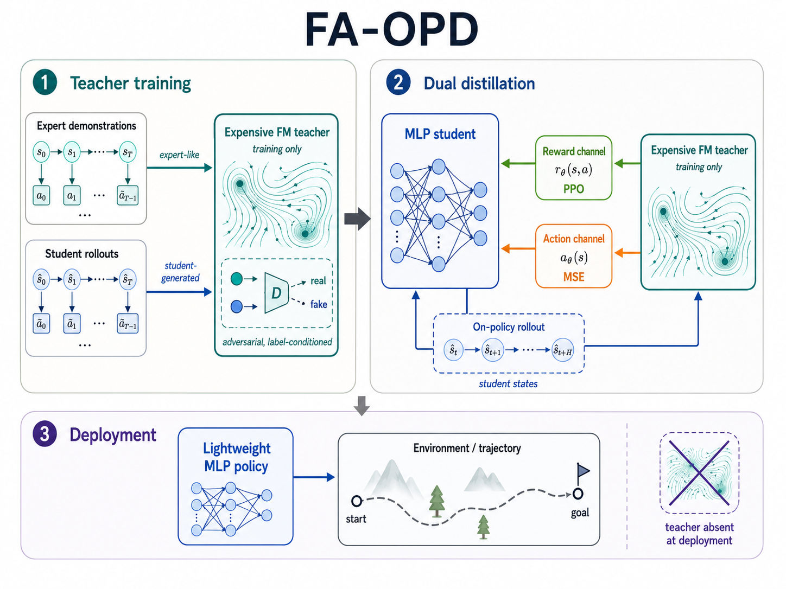
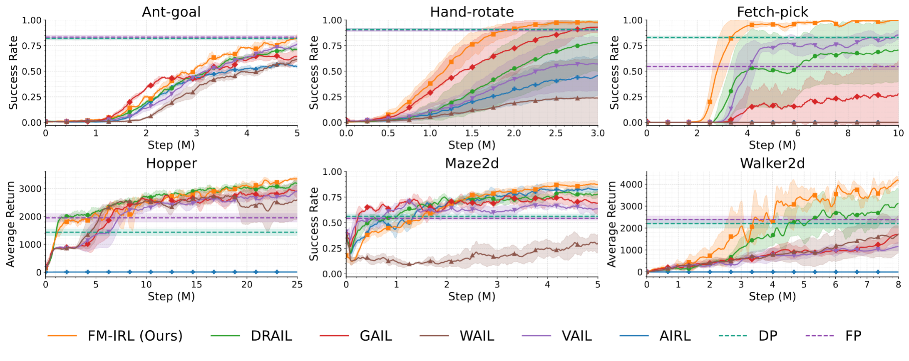

<div align="center">
  <picture>
    
  </picture>

  <br>

  <h1>FA-OPD</h1>

  <a href="https://github.com/vanzll/FA-OPD"></a>
  <a href="https://arxiv.org/abs/2605.27095"></a>
  
  
  
  

  <h3>Train with an expressive Flow Matching teacher. Deploy a lightweight MLP policy.</h3>

  <p>
    <a href="https://arxiv.org/abs/2605.27095">Paper</a> ·
    <a href="#quick-start">Quick start</a> ·
    <a href="#method">Method</a> ·
    <a href="#experiments">Experiments</a> ·
    <a href="#acknowledgements">Acknowledgements</a> ·
    <a href="#citation">Citation</a>
  </p>
</div>

---

## What This Repository Provides

**FA-OPD** is the official implementation of [*Adversarial Dual On-Policy Distillation from Expressive Flow-based Teacher*](https://arxiv.org/abs/2605.27095). It targets learning-from-demonstrations settings where reward design is difficult, demonstrations are available, and the deployed controller must remain cheap.

The repository includes:

- the FA-OPD training loop and Flow Matching teacher modules;
- PPO-compatible MLP student policies for efficient deployment;
- diffusion, Flow Matching, GAIL/AIRL/WAIL/DRAIL, and online FM-policy baselines;
- expert demonstrations tracked with Git LFS;
- W&B sweep configs for navigation, manipulation, and locomotion benchmarks.

## Method

FA-OPD uses the Flow Matching model as a **training-time teacher**, not as the deployed actor.

<div align="center">
  
</div>

| Signal | Teacher role | Student update | Effect |
|---|---|---|---|
| Reward distillation | FM-enhanced discriminator scores each visited state-action pair | PPO maximizes expert-likeness rewards | Online improvement and exploration |
| Action distillation | FM generator supplies target actions at student-visited states | MLP regresses onto teacher actions | Dense local correction and stability |
| Deployment | Teacher removed | MLP forward pass only | Low-latency control |

The result is a compact student policy that benefits from an expressive teacher during training without paying the flow-inference cost at deployment.

## Repository Map

```text
FA-OPD/
├── faopd/
│   ├── main.py              # experiment entry point
│   ├── faopd_algo.py        # FA-OPD algorithm
│   ├── flow_matching/       # FM teacher and discriminator
│   ├── ddpm/                # diffusion-policy baseline modules
│   ├── fm_a2c.py            # online FM-policy A2C baseline
│   ├── fm_ppo.py            # online FM-policy PPO baseline
│   └── fpo_algo.py          # FM policy-gradient baseline
├── configs/                 # W&B sweep configs
├── expert_datasets/         # demonstrations tracked with Git LFS
├── goal_prox/               # customized environments
├── rl-toolkit/              # RL and imitation-learning infrastructure
├── d4rl/                    # Maze2D dependency
├── utils/                   # setup and logging helpers
└── assets/                  # README figures
```

## Installation

The experiments were run with Python 3.8, CUDA 11.7, PyTorch 1.13, MuJoCo, W&B, and Git LFS.

```bash
git lfs install
git clone https://github.com/vanzll/FA-OPD.git
cd FA-OPD
git lfs pull

conda create -n faopd python=3.8
conda activate faopd
bash utils/setup.sh
```

For MuJoCo build issues:

```bash
sudo apt-get install libglew-dev libosmesa6-dev
conda install -c conda-forge gcc=12.1.0
```

## Quick Start

All runs are launched from W&B sweep configs.

```bash
wandb login
bash utils/wandb.sh configs/ant/faopd.yaml
```

FA-OPD configs:

```text
configs/ant/faopd.yaml
configs/hand/faopd.yaml
configs/pick/faopd.yaml
configs/maze/faopd.yaml
configs/hopper/faopd.yaml
configs/walker/faopd.yaml
```

Baseline configs live in the same task folders:

```text
airl.yaml
diffusion-policy.yaml
drail.yaml
fm_policy.yaml
gail.yaml
wail.yaml
```

Maze2D also includes online FM-policy baselines:

```text
fm-a2c.yaml
fm-ppo.yaml
fpo.yaml
```

Logs are written to:

```text
data/log/<environment>_<method>/<seed>/metrics.csv
```

## Demonstrations

The demonstration tensors are stored in `expert_datasets/`:

| File | Task family |
|---|---|
| `ant_50.pt` | Navigation |
| `maze2d_25.pt` | Navigation |
| `hand_10000.pt` | Manipulation |
| `pick_10000.pt` | Manipulation |
| `ppo_hopper_1.pt` | Locomotion |
| `ppo_walker_1.pt` | Locomotion |

If a file is a small Git LFS pointer instead of a tensor, run `git lfs pull`.

## Experiments

<div align="center">
  
</div>

| Method | Ant-goal | Maze2d | Hand-rotate | Fetch-pick | Hopper | Walker2d |
|---|---:|---:|---:|---:|---:|---:|
| DRAIL | 0.7142 | 0.7780 | 0.7775 | 0.7052 | 3182.60 | 3122.69 |
| GAIL | 0.6465 | 0.6902 | 0.9317 | 0.2798 | 2921.73 | 1698.25 |
| WAIL | 0.6127 | 0.2978 | 0.2370 | 0.0000 | 2609.28 | 1729.20 |
| VAIL | 0.7662 | 0.6360 | 0.5694 | 0.8539 | 2878.04 | 1156.52 |
| AIRL | 0.5467 | 0.8239 | 0.4595 | 0.0000 | 7.86 | -5.27 |
| Diffusion Policy | 0.8212 | 0.5618 | 0.9068 | 0.8298 | 1433.21 | 2204.41 |
| Flow Matching Policy | **0.8334** | 0.5420 | 0.9032 | 0.5460 | 1950.41 | 2384.81 |
| **FA-OPD** | 0.8225 | **0.8731** | **0.9794** | **0.9984** | **3358.95** | **4164.24** |

Navigation and manipulation tasks report average success rate. Locomotion tasks report average return.

## Implementation Notes

- Main entry point: `faopd/main.py`
- Proposed method key: `faopd`
- Deployed actor: MLP student policy
- Training-only teacher: Flow Matching discriminator/generator
- Experiment launcher: `utils/wandb.sh`

Third-party components remain in their upstream-style subdirectories and retain their own licensing terms.

## Acknowledgements

This repository builds on several open-source research codebases. In particular, we thank the authors of [DRAIL](https://github.com/NVlabs/DRAIL) for releasing their official implementation, which informed the DRAIL baseline integration used in our comparisons.

## Citation

```bibtex
@inproceedings{wan2026faopd,
  title     = {Adversarial Dual On-Policy Distillation from Expressive Flow-based Teacher},
  author    = {Wan, Zhenglin and Wu, Jingxuan and Yu, Xingrui and Zhang, Chubin and Lei, Mingcong and An, Bo and Tsang, Ivor W. and You, Yang},
  booktitle = {Proceedings of the 43rd International Conference on Machine Learning},
  eprint    = {2605.27095},
  archivePrefix = {arXiv},
  primaryClass  = {cs.LG},
  url       = {https://arxiv.org/abs/2605.27095},
  year      = {2026}
}
```
